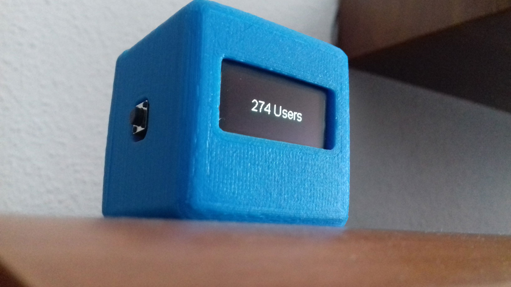
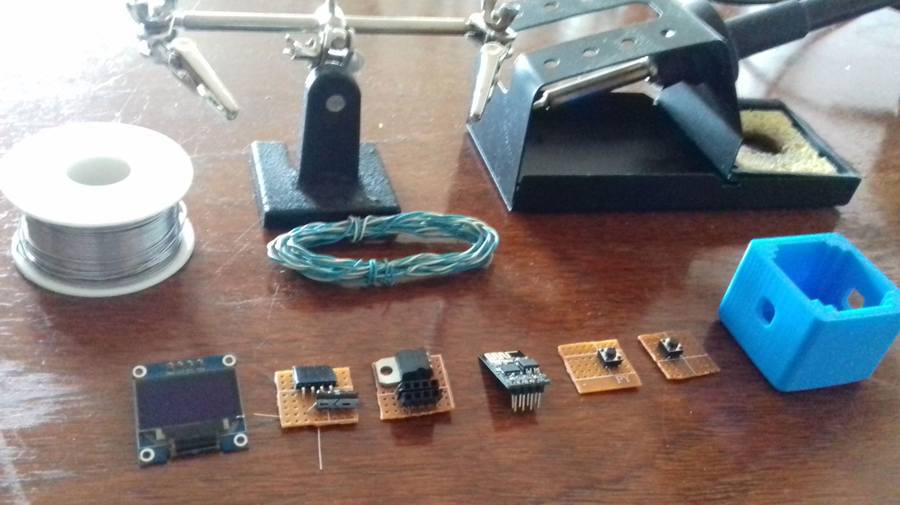

OLED Dashboard
==============



#### Part list

- [3D printed enclosure](enclosure/enclosure.stl)
- SSD1306 OLED display
- 4 angled female headers
- 8 straight female headers
- 1 10µf decoupling capacitor
- 1 L1117 3.3v voltage regulator
- 1 ESP8266 module (ESP-01 package)
- 2 Push buttons
- 4 pieces of perfboard
- A bunch of wire & some solder



#### Edit server config in: [src/config.h](src/config.h)

```c++
// Server config
struct {
  const char* server;
  const uint16_t port;
  const char* path;
  const char* thumbprint;
  const bool tls;
  const char* version;
} config = {
  "SERVER_HOST", 443, "/",
  "TLS_CERT_THUMBPRINT", true,
  FIRMWARE_VERSION
};
```

##### The first time, you'll need to upload the sketch over serial (using a Raspberry PI's UART or a USB2TTL dongle):
`platformio run --target=upload --upload-port=SERIAL_PORT`

#### Network config:

- Hold the secondary button while powering the board
- It will start a WiFi access point with the ssid: "OLED-YOUR_CHIP_ID".
- The OLED will display a random password
- Use that password to connect to that network with any device that has a web browser
- Visit: http://192.168.1.1/
- Select a network, type the password and hit submit
- The board will automatically restart and resume normal operation.

#### Pushing data:

```js
const server = new Server();
// This will be sent to all connected clients that have that stream selected
// The last frame is cached to be sent when clients switch to the stream
server.push(UINT8_STREAM_ID, 'Arbitrary data');
// You can also push images
const image = Image.fromFile(path.join(__dirname, 'test.png'));
server.push(UINT8_STREAM_ID, image);
```

You can see some example streams in: [server/index.js](server/index.js).

#### Dev Server:

- cd server
- yarn install
- yarn dev

While in development, the server will watch the output directory of platformio and every time you run "platformio run" it will try to push the firmware to all connected clients.


#### Production Server:

- cd server
- docker-compose -p DashboardServer up -d --build

While in production, the latest firmware inside the '[server/firmwares](server/firmwares)' folder will be flashed to all clients with a prior version. The firmware filenames should follow the naming convention: `MAJOR.MINOR.PATCH.bin`
